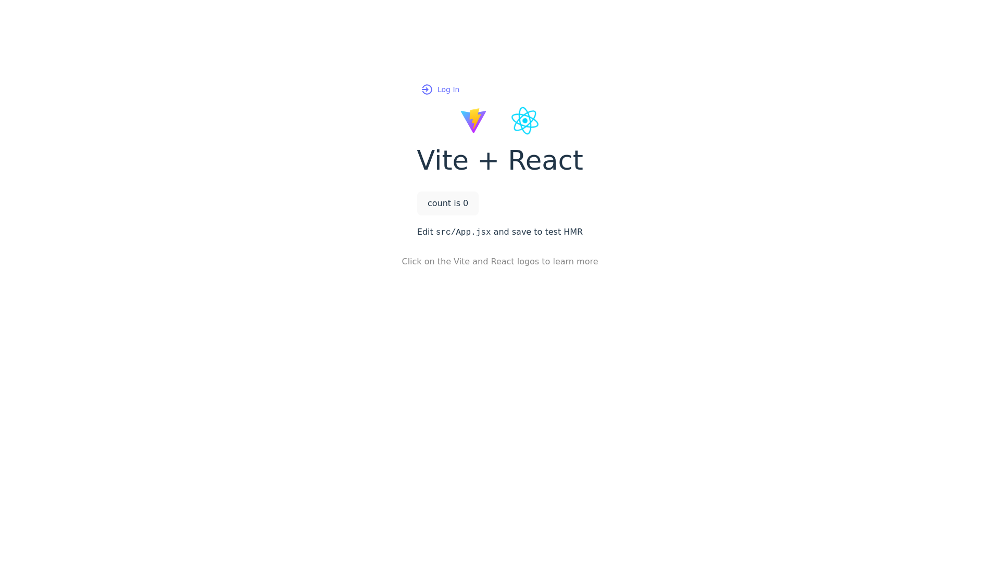

    updated on: 13th March 2025, Thursday

<div align=center>
    <a href="https://warmachine028.github.io/vite-gh">
        
    </a>
    <p style="font-family: roboto, calibri; font-size:12pt; font-style:italic"> A good one liner description here </p>
    <a src="https://github.com/warmachine028/vite-gh/forks">
        
    </a>
</div>

# [Vite Gh](https://github.com/warmachine028/vite-gh)

![line]

## Table of Contents

- [Introduction](#introduction)
- [Getting Started](#getting-started)
- [Developement](#developement)
- [Tech Stack Used](#tech-stack-used)
- [Preview](#preview)
- [Best Contributors](#best-contributors)
- [License](#license)

![line]

## Introduction

- A basic project to deploy vite project with react-router-dom to github-pages.

## Getting Started

- Supports basic auth
- Supports theme
- User Dashboard
- Supports auto deploy on push using `github actions`

![line]

## Developement

```sh
> cd client
> npm i
> npm run dev
```

![line]

## Tech Stack Used

- Vite
- React
- JavaScript
- GitHub Pages
- GitHub Actions
- Markdown
- Dependabot

          

![line]

## Preview

<picture align="center">
    <source media="(prefers-color-scheme: light)" srcset=".github/preview-light.png">
    <source media="(prefers-color-scheme: dark)" srcset=".github/preview-dark.png">
    
</picture>

![line]

## Best Contributors

<div align="center">
    <a href="https://github.com/warmachine028/vite-gh/graphs/contributors">
        
    </a>
</div>

![line]

## License

- See [LICENSE]

**Pritam Kundu, 2024**

![line]

## Thank you, everyone 💚

[icons]: https://icons8.com/
[markdown-badges]: https://github.com/Ileriayo/markdown-badges
[line]: https://user-images.githubusercontent.com/75939390/137615281-3a875960-92cc-407f-97fe-fd2319bdb252.png
[License]: https://github.com/warmachine028/vite-gh/blob/main/LICENSE

<!-- 13/03/25 -->
